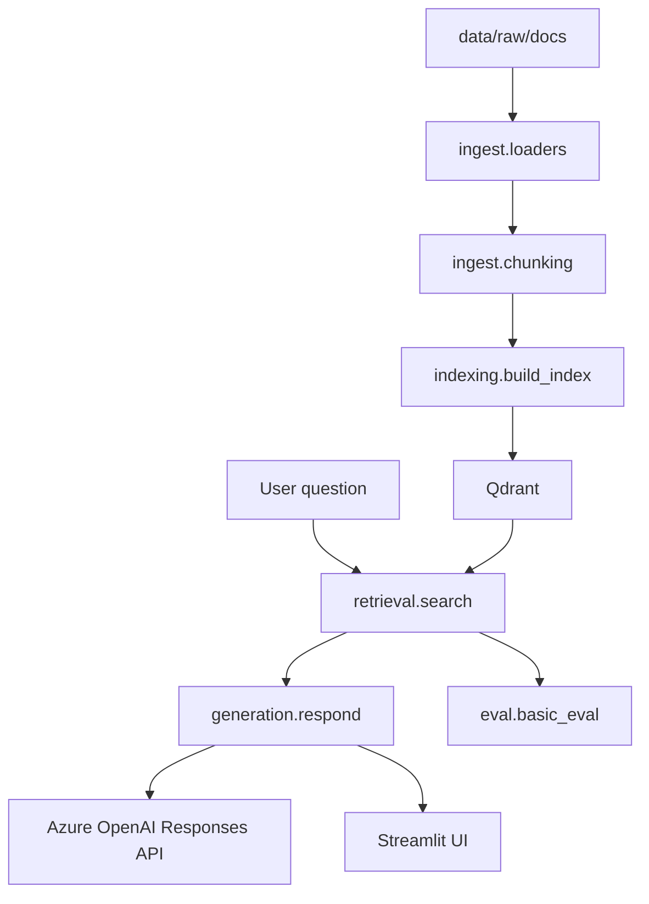

# my-rag-project

A minimal, learning-first Retrieval-Augmented Generation (RAG) skeleton built with:

- Azure OpenAI Responses API
- LlamaIndex
- Qdrant
- Streamlit
- Ragas

The goal is to understand the core RAG stages clearly:
document loading, chunking, indexing, retrieval, grounded generation, and evaluation.

## Project structure

```text
app/
  config.py                # Shared environment-based settings
  clients.py               # Azure OpenAI and Qdrant client helpers
  ingest/
    loaders.py             # Read local files into LlamaIndex documents
    chunking.py            # Split documents into chunks
  indexing/
    build_index.py         # Embed chunks and store them in Qdrant
  retrieval/
    search.py              # Retrieve top-k chunks from Qdrant
  generation/
    respond.py             # Build grounded prompts and call Responses API
  eval/
    basic_eval.py          # Minimal Ragas wrapper + starter eval loader
  ui/
    streamlit_app.py       # Streamlit interface

data/
  raw/docs/                # Active source documents for indexing
  eval/                    # Tiny hand-written evaluation sets
  processed/               # Reserved for future processed artifacts

docs/                      # Setup notes, stack decisions, theory
tests/
  test_generation.py       # Basic unit test for prompt/context formatting
```

## Architecture



## Setup

```bash
python -m venv .venv
source .venv/bin/activate
pip install -r requirements.txt
cp .env.example .env
```

Fill in `.env` with:

- Azure OpenAI endpoint, API version, API key
- Azure OpenAI chat deployment name
- Azure OpenAI embedding deployment name
- Qdrant storage: either `QDRANT_LOCAL_PATH` for a local embedded store (default, no server needed) or `QDRANT_URL` plus optional API key for Qdrant Cloud

The values in `.env.example` are the contract the app expects. Keep secrets in `.env`, never commit that file.

## Run the project

1. The default learning corpus is the three PDFs in `data/raw/docs/`:

   - `Chapter_4_Evaluate_AI_Systems.pdf`
   - `Chapter_5_Prompt_Engineering.pdf`
   - `Chapter_6_RAG_and_Agents.pdf`
2. Build the vector index:

```bash
python -m app.indexing.build_index
```

3. Start the Streamlit app:

```bash
.venv/bin/streamlit run app/ui/streamlit_app.py --server.fileWatcherType poll
```

4. Ask a question in the UI and inspect the returned source chunks.

If you want to swap corpora later, override `RAW_DATA_DIR` and `SOURCE_FILE_NAMES` in `.env` instead of changing loader code.
When you change corpora, also use a fresh `QDRANT_COLLECTION_NAME` or delete the old collection first so stale vectors do not mix with the new baseline.

## Current default corpus

The current default setup uses:

- `RAW_DATA_DIR=data/raw/docs`
- `SOURCE_FILE_NAMES=Chapter_4_Evaluate_AI_Systems.pdf,Chapter_5_Prompt_Engineering.pdf,Chapter_6_RAG_and_Agents.pdf`
- Azure chat and embedding deployments configured separately
- `AZURE_OPENAI_API_VERSION=2025-03-01-preview`
- `QDRANT_LOCAL_PATH=qdrant_data` (local embedded store; Qdrant Cloud via `QDRANT_URL` remains supported)
- `QDRANT_COLLECTION_NAME=book_chapters_4_6`

Good first questions:

- `What does evaluation-driven development mean?`
- `Why should teams use prompting before finetuning?`
- `Why does longer context not remove the need for RAG?`

The original smoke test used repo markdown docs copied into `data/raw/docs/`. That corpus was useful for first-pipeline debugging, but these three book chapters are a better learning baseline because they are still small while giving more realistic retrieval questions.

## Troubleshooting

- If indexing fails, check the embedding deployment and Qdrant settings before changing retrieval code.
- If retrieval looks inconsistent after changing corpora, make sure you are not reusing a collection that still contains old chunks.
- If retrieval works but generation fails, check `AZURE_OPENAI_API_VERSION` before changing prompts.
- If Streamlit import errors mention `app`, make sure the entrypoint is `app/ui/streamlit_app.py`.
- For local testing, prefer running the app from your own terminal inside `.venv`.
- The local embedded Qdrant store allows only one process at a time. Stop the Streamlit app before running `build_index` or `scripts.inspect_store` (and vice versa), or you will hit a storage lock error.

## Run tests

```bash
pytest tests/
```

## Evaluation

`app/eval/basic_eval.py` provides a minimal Ragas-ready wrapper:

- `EvalSample` keeps evaluation inputs explicit.
- `StarterEvalCase` keeps the hand-written gold questions separate from runtime answers.
- `load_starter_eval_cases()` reads `data/eval/chapters_4_6_starter.json`.
- `build_eval_sample()` turns one starter case into a runtime `EvalSample` after retrieval and answer generation.
- `build_ragas_dataset()` converts plain Python samples into a Ragas dataset.
- `run_ragas_evaluation()` lets you pass metrics later without hardwiring a more advanced evaluation pipeline yet.

Each starter case stores:

- a question
- a reference answer
- expected source file names

This keeps the first evaluation loop simple: check whether retrieval hits the expected chapter, then compare the grounded answer against the hand-written reference.

## What this version intentionally does not include

- LiteLLM
- MCP
- DSPy
- GraphRAG
- agents
- reranking or hybrid retrieval

This keeps version one small enough to study before adding more moving parts.
