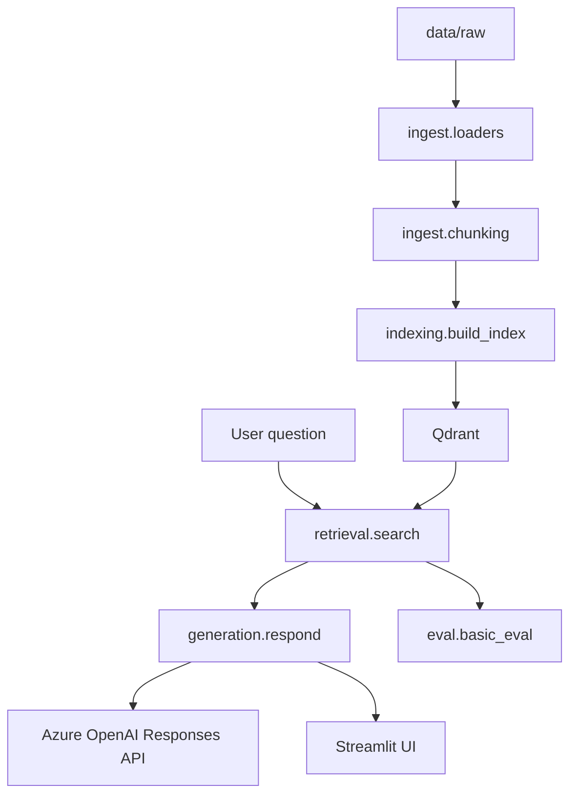

# my-rag-project

A minimal, learning-first Retrieval-Augmented Generation (RAG) skeleton built with:

- Azure OpenAI Responses API
- LlamaIndex
- Qdrant
- Streamlit
- Ragas

The goal is to understand the core RAG stages clearly:
document loading, chunking, indexing, retrieval, grounded generation, and evaluation.

## Project structure

```text
app/
  config.py                # Shared environment-based settings
  clients.py               # Azure OpenAI and Qdrant client helpers
  ingest/
    loaders.py             # Read local files into LlamaIndex documents
    chunking.py            # Split documents into chunks
  indexing/
    build_index.py         # Embed chunks and store them in Qdrant
  retrieval/
    search.py              # Retrieve top-k chunks from Qdrant
  generation/
    respond.py             # Build grounded prompts and call Responses API
  eval/
    basic_eval.py          # Minimal Ragas dataset + evaluation wrapper
  ui/
    streamlit_app.py       # Streamlit interface

data/
  raw/                     # Source documents for indexing
  processed/               # Reserved for future processed artifacts

docs/                      # Setup notes, stack decisions, theory
tests/
  test_generation.py       # Basic unit test for prompt/context formatting
```

## Architecture



## Setup

```bash
python -m venv .venv
source .venv/bin/activate
pip install -r requirements.txt
cp .env.example .env
```

Fill in `.env` with:

- Azure OpenAI endpoint, API version, API key
- Azure OpenAI chat deployment name
- Azure OpenAI embedding deployment name
- Qdrant URL and optional API key

The values in `.env.example` are the contract the app expects. Keep secrets in `.env`, never commit that file.

## Run the project

1. Put local source documents in `data/raw/`.
2. Build the vector index:

```bash
python -m app.indexing.build_index
```

3. Start the Streamlit app:

```bash
.venv/bin/streamlit run app/ui/streamlit_app.py --server.fileWatcherType poll
```

4. Ask a question in the UI and inspect the returned source chunks.

## Known-good smoke test

The first working smoke test used:

- the repo markdown docs copied into `data/raw/docs/`
- Azure chat and embedding deployments configured separately
- `AZURE_OPENAI_API_VERSION=2025-03-01-preview`
- Qdrant Cloud with a full HTTPS endpoint in `QDRANT_URL`
- `QDRANT_COLLECTION_NAME=my-rag-chunks`

Good first questions:

- `Why are we avoiding LiteLLM in v1?`
- `What does the app need to support for Azure OpenAI Responses API?`
- `Why does chunk quality matter in this project?`

## Troubleshooting

- If indexing fails, check the embedding deployment and Qdrant settings before changing retrieval code.
- If retrieval works but generation fails, check `AZURE_OPENAI_API_VERSION` before changing prompts.
- If Streamlit import errors mention `app`, make sure the entrypoint is `app/ui/streamlit_app.py`.
- For local testing, prefer running the app from your own terminal inside `.venv`.

## Run tests

```bash
pytest tests/
```

## Evaluation

`app/eval/basic_eval.py` provides a minimal Ragas-ready wrapper:

- `EvalSample` keeps evaluation inputs explicit.
- `build_ragas_dataset()` converts plain Python samples into a Ragas dataset.
- `run_ragas_evaluation()` lets you pass metrics later without hardwiring a more advanced evaluation pipeline yet.

## What this version intentionally does not include

- LiteLLM
- MCP
- DSPy
- GraphRAG
- agents
- reranking or hybrid retrieval

This keeps version one small enough to study before adding more moving parts.
