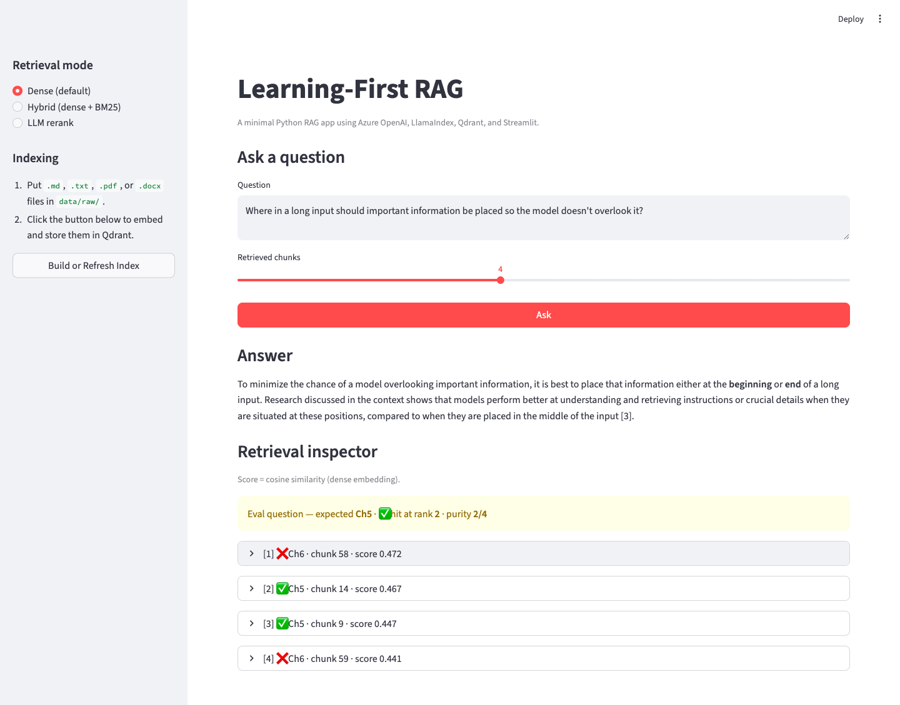
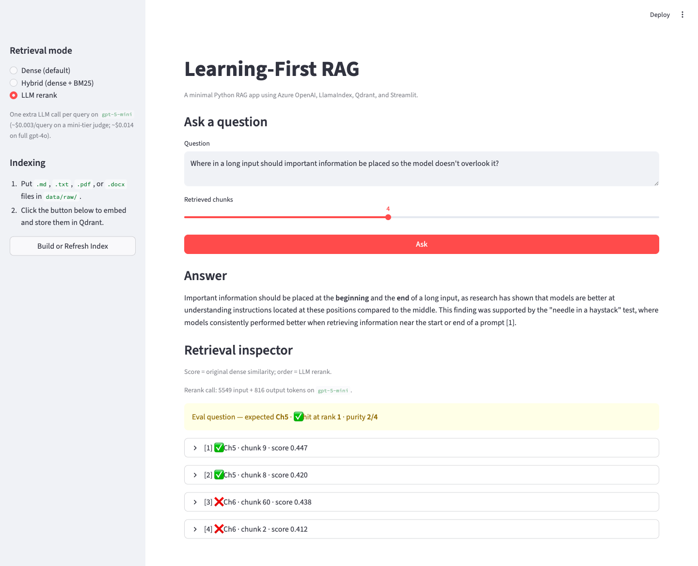

# Case study: building and measuring a RAG system from first principles

> Assembled 2026-07-19 from the artifacts in `eval/` and `assets/`; export format for the website TBD.

## The pitch

A minimal RAG system built stage by stage — loading, chunking, indexing, retrieval, grounded generation — and then improved by measurement instead of feature accretion. A hand-built 15-question eval set gated every retrieval feature: a chunking sweep (null result), hybrid BM25 retrieval (rejected on evidence), and LLM reranking (split decision). None of the three displaced the dense baseline, and that is the point: three cheap, honest negatives bounded the system's residual error as content ambiguity rather than a retriever defect — for about a dollar of API spend. Corpus: three chapters of Chip Huyen's *AI Engineering* (evaluation, prompt engineering, RAG & agents) — small enough to inspect by hand, real enough to expose retrieval failures.

## Architecture

_Mermaid source: [`architecture.mmd`](architecture.mmd)._

Stack: Python, LlamaIndex Core, Qdrant (local embedded), Azure OpenAI (separate embedding + chat deployments, Responses API), Ragas, Streamlit.

## The arc

The spine of the project is one loop, run honestly, five times: measure, change one thing, re-measure, keep or revert.

1. **The baseline saturates on day one.** The 4-question starter set scored 100% hit@4, every first hit at rank 1. A perfect score on the first measurement is a broken instrument, not a solved problem — the eval set had to get harder before any feature could show a gain.
2. **Redesign the instrument, not the system.** The set grew to 15 adversarial questions: no chapter names, paraphrased concepts, deliberate Ch5/Ch6 vocabulary traps. Hit@4 *stayed* at 100% — with 3 source files and 4 retrieved chunks it is structurally unmissable — so the gating metrics became the finer ones already being collected: chunk purity (55/60) and first-hit rank (worst: 2, on the designed trap Q8).
3. **Three mechanisms, three honest verdicts.** A chunking sweep (256/512/1024) returned a null: geometry redistributes the cross-chapter confusion, never removes it. Hybrid dense+BM25 was rejected: the lexical side is strictly weaker on paraphrased questions and fails the Q8 trap identically, so fusion pollutes four clean questions to gain one chunk. LLM listwise reranking split: the first change to fix Q8's rank — stable across repeat runs — but it stably broke a question dense had perfect, netting zero. Dense top-4 stayed the default through all three.
4. **The ceiling is the content, not the retriever.** When geometry, lexical signal, and a candidate-reading reranker all leave the same ~8% impurity, the residual is cross-chapter content overlap — chapters that genuinely discuss the same material. Retrieval-side iteration closed there, deliberately, with the boundary measured rather than assumed.
5. **Make the measurement visible.** A Streamlit retrieval inspector shows, per chunk, the chapter, score, and expected-vs-actual judgment against the eval set, with a dense/hybrid/rerank toggle. The eval table's worst row is now a live demo — Q8 in dense mode retrieves an off-target Chapter 6 chunk at rank 1:

   

   Toggle to rerank mode and the needle-in-a-haystack Chapter 5 passage is promoted to rank 1:

   

   The full toggle sequence as a GIF: [mode-toggle demo](assets/2026-07-19-mode-toggle.gif).

## Timeline of measured iterations

| Milestone | Date | Retrieval hit rate | Notes |
|-----------|------|--------------------|-------|
| Working skeleton | 2026-04-04 | — | end-to-end pipeline on smoke corpus |
| Real corpus + gold set | 2026-04-09 | — | chapters 4–6, 4 starter questions |
| Baseline measured | 2026-07-18 | 4/4 (100%) hit@4 | starter set saturated — all first hits at rank 1; eval set must get harder before features can show gains ([details](eval/2026-07-18-baseline.md)) |
| Eval set expanded 4 → 15 | 2026-07-18 | 15/15 (100%) hit@4, purity 55/60 (92%) | hit@4 turns out to be structurally unmissable at chapter level on a 3-file corpus; purity and first-hit rank (worst: 2, on the designed Ch5/Ch6 trap) are now the metrics features must move ([details](eval/2026-07-18-expanded-set.md)) |
| Chunking sweep (256/512/1024) | 2026-07-19 | purity 92% / 92% / 90%, mean rank 1.13 / 1.07 / 1.00 | first measured feature iteration — and a deliberate null result: chunk size redistributes the Ch5/Ch6 confusion between rank and purity but never removes it; 512/80 kept, fix deferred to hybrid/reranking ([details](eval/2026-07-19-chunking-comparison.md)) |
| Hybrid retrieval (dense + BM25, RRF) | 2026-07-19 | purity 92% (dense) vs 87% (hybrid) vs 72% (BM25-only) | second negative result, hybrid rejected on evidence: the lexical side is strictly weaker on a paraphrase-heavy eval set and fails the Ch5/Ch6 trap identically to dense, so equal-weight fusion pollutes four clean questions to gain one chunk; dense stays, and two nulls now triangulate the fix to reranking ([details](eval/2026-07-19-hybrid-comparison.md)) |
| LLM listwise reranking (gpt-4o, dense top-12 → top-4) | 2026-07-19 | purity 92% (dense) vs 93% / 92% (rerank ×2 runs) | split decision: the first change to move the Q8 acid test (rank 2 → 1, stable across both runs) and a full Q3 fix, but a stable Q5 regression cancels the gains — the wider candidate pool that lets a reranker fix one question exposes off-target text on another; dense stays the default, and the residual ~8% impurity is reclassified as genuine cross-chapter content overlap, closing retrieval-side iteration ([details](eval/2026-07-19-rerank-comparison.md)) |
| Rerank coda: judge swapped to gpt-5-mini | 2026-07-19 | purity 92% ×2 runs, mean first-hit rank **1.00** ×2 | the judge model turns out to be a hyperparameter: gpt-5-mini puts every question at rank 1 in both runs (no Q5-style rank regression) at ~¼ gpt-4o's cost — but purity stays a 55/60 wash, so the split decision narrows without flipping; dense remains the default ([details](eval/2026-07-19-rerank-gpt5mini-coda.md)) |
| Retrieval inspector UI + mode toggle | 2026-07-19 | — | the measured comparison becomes demo-able: Streamlit inspector shows per-chunk chapter/score/on-target highlighting against the eval set, with a dense/hybrid/rerank toggle — the Q8 trap and its rerank fix, live ([dense](assets/2026-07-19-inspector-q8-dense.png) · [rerank](assets/2026-07-19-inspector-q8-rerank.png) · [GIF](assets/2026-07-19-mode-toggle.gif)) |

## Interesting failures and fixes

Each entry is a measured near-miss and what it taught; dates link back to the artifact log.

- **A metric that can't fail measures nothing.** Hit@4 at chapter granularity on
  a 3-file corpus is structurally unmissable — all four retrieved chunks would
  have to come from the two wrong chapters. Expanding the eval set from 4 to 15
  much harder questions left it at 100%; the real signal moved to chunk purity
  (55/60) and first-hit rank. (2026-07-18)
- **Dense retrieval shrugs at paraphrase but stumbles on shared vocabulary.**
  The question written with *zero* lexical overlap with its target passage
  ("the bot ruins the magic for children" → the Santa/fictional-characters
  example) retrieved perfectly. The question that reused vocabulary two chapters
  share ("where in a long input should information go?" — prompt-position advice
  in Ch5 vs long-context-vs-RAG in Ch6) produced the first rank-2 result and
  2/4 purity. Hardness for embeddings is cross-document lexical confusion, not
  obliqueness. (2026-07-18)
- **Chunk size moves the failure around; it doesn't remove it.** Sweeping
  256/512/1024-token chunks against the same eval set, the two Ch5/Ch6-trap
  questions kept off-target chunks in the top-4 in *every* config — smaller
  chunks traded one question's rank for another's, larger chunks fixed every
  rank while diluting purity (and would double per-answer context cost). A
  geometry knob can't fix a discrimination problem: separating confusable
  chapters needs lexical signal (hybrid) or a reranker. Also a measurement
  lesson: purity fractions aren't comparable across chunk sizes — 2/4 of
  512-token chunks and 1/4 of 1024-token chunks are the *same* on-target
  tokens in twice the context. (2026-07-19)
- **When both retrievers agree on the wrong answer, no fusion can save you.**
  Hybrid dense+BM25 via reciprocal rank fusion was supposed to separate the
  confusable chapters through distinctive-term weighting. Measured: BM25-only
  purity 72% vs dense 92% on a deliberately paraphrase-heavy eval set, and on
  the worst question (Q8) BM25 produced the *same* wrong ranking as dense —
  the chapters share their distinctive vocabulary too. Equal-weight RRF
  therefore averaged a strong ranking with a weak one: one chunk gained, four
  lost. The negative result is more useful than a win would have been: chunk
  geometry and lexical signal are both ruled out, which narrows the fix to a
  reranker that reads candidate text against the question. (2026-07-19)
- **The reranker giveth and the reranker taketh away.** An LLM listwise
  reranker (gpt-4o reading dense's top-12, one chat call per question, zero
  new dependencies) was the first change in three iterations to move the
  hardest question: Q8's first-hit rank went 2 → 1 in both runs. But it
  stably broke a question dense had perfect: widening the candidate pool
  from 4 to 12 exposed two plausible-reading off-target chunks on Q5, and
  the reranker promoted one to rank 1. Net aggregate effect ≈ zero
  (55–56/60 vs 55/60), at ~$0.014 + 1–2 s per query. Two structural
  lessons: a reranker can only reorder what the candidate generator hands
  it, and the wider pool that gives it room to fix one question gives it
  rope to hang itself on another. A nondeterministic component also forced
  a measurement upgrade — repeat runs, separating stable effects from ±1
  jitter. Three mechanisms later (geometry, lexical, reader), the residual
  ~8% impurity looks like genuine cross-chapter content overlap, not a
  retriever defect: retrieval-side iteration on this corpus closed here.
  (2026-07-19)
- **The judge model is a hyperparameter, and n=1 smoke tests mislead.**
  Rerouting the rerank call from gpt-4o to gpt-5-mini after a single perfect
  Q8 smoke test (4/4 rank 1), the full two-run coda told a subtler story:
  the perfect purity didn't replicate (2–3/4, same band as gpt-4o), but
  something better appeared — *every* question reached first-hit rank 1 in
  both runs, with none of gpt-4o's rank regressions, at ~¼ the cost. Rank
  joined hit@4 as a saturated metric; purity stayed a 55/60 wash, so the
  default didn't change. Two lessons: repeat runs are what separate a real
  effect from sampling luck, and a saturated metric stops discriminating —
  each new component can retire a metric from the eval. (2026-07-19)

## Key engineering decisions

Source: `docs/decisions/` (ADRs 001–005).

- **Eval-gated feature additions** (ADR 005) — no retrieval feature merges as a default without a measured before/after on the gold set. This single rule produced the whole arc above.
- **Explicit corpus selection + fresh collection names per corpus** — stale vectors from a previous corpus silently pollute results; a new collection name per corpus change makes contamination structurally impossible.
- **Retrieval and generation debugged as separate stages** — a wrong answer has two very different failure modes; the eval set judges retrieval alone so generation quality can't mask retrieval defects (or vice versa).
- **Local embedded vector store over cloud** — for a single-user learning system, an embedded Qdrant store removes a network dependency, a credential, and a bill; its one real cost (single-client lock) was found and handled.
- **Opt-in, not deleted** — rejected features (hybrid, rerank) stay in the code behind `--mode` flags as documented controls, so every comparison in this write-up remains reproducible.

## Learnings worth publishing

Distilled from the checkpoint log — the ones that generalize beyond this repo.

1. **A metric that can't fail measures nothing.** Chapter-level hit@4 on a 3-file corpus is structurally unmissable, so 100% is silence, not success. When a binary metric saturates, move to the finer signals already being collected (purity, first-hit rank) before celebrating or redesigning.
2. **For embeddings, hardness is shared vocabulary, not oblique wording.** The question with *zero* lexical overlap with its target retrieved perfectly; the questions reusing vocabulary two chapters share are the ones that degraded. Adversarial eval questions come from cross-document lexical confusion, not paraphrase distance.
3. **Negative results compound.** The chunking null ruled out geometry; the hybrid rejection ruled out lexical signal. Two cheap nulls narrowed the fix space to rerankers with more confidence than a single lucky win would have — and made the eventual "content ceiling" verdict credible.
4. **Measure a new component alone before composing it.** The free BM25-only diagnostic (72% purity) explained the hybrid regression instantly and proved no fusion weighting could win. Fusion only helps where retrievers disagree and the added one is right often enough.
5. **A nondeterministic component demands repeat runs.** One 15-question run can't tell a +1 purity win from sampling luck: repeat runs separated the stable effects (Q3 gain, Q8 rank fix, Q5 regression) from ±1-chunk jitter — and the n=1 smoke test's perfect score didn't replicate.
6. **The judge model is a hyperparameter.** The same rerank prompt moved from gpt-4o to gpt-5-mini saturated first-hit rank (1.00, both runs, no regressions) at a quarter of the cost. Model choice inside a component deserves the same measured treatment as the component itself.
7. **Know when a metric hits its content ceiling.** When three different mechanisms — geometry, lexical signal, a reading reranker — leave the same residual error, stop blaming the component and re-examine the labels: the surviving ~8% impurity is chapters genuinely covering overlapping material. Declaring an iteration line closed, on evidence, is a finding.
